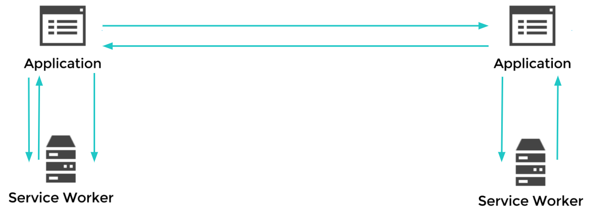
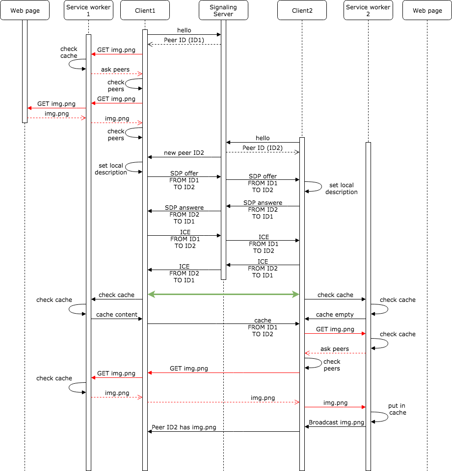

# PeerToPeer CDN
This project provides a peer to peer CDN to deliver content directly between browsers in a collaborative manner. It uses Webrtc for the content delivery and service worker to intercept requests. This project aims to be a plugin solution. So the changes required to add the peer to peer CDN should keept as small as possible. Currently only the whitelist of shareable ressources needs to be changed to adapt the cdn to a new project.

## Browser Support
The Project is currently tested and developed for Chrome 68 only.

## Project Structure

| Folder        |                                                                 |
| ------------- |-------------                                                    |
| bin           | Contains the node js server for the demo app                    |
| build         | Contains scripts to compile and minify the es6 javascript code  |
| scr           | Contains the es6 source files for the p2p cdn                   |
| web_app       | Contains the example application                                |

## Setup

You need to insall the depending npm package before running the demo app:
```console
npm install
```
The Javascript code of this Project is written in ES6 to compile the Javascript code please run:
```console
npm install
npm run babel
npm run minify
```

To run the demo app please run:
```console
node index.js
```

### Docker container

- Stun server

## Architecture

### Message Protocol


## Roadmap
- Make it adaptable for other Projects
- Prevent reaching the quota limits

## Collaborators
- Johannes Maximilian Kroschewski
- Tim Friedrich
- Nils Straßenburg
