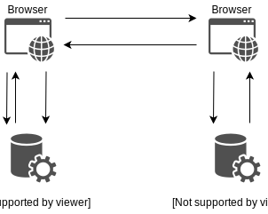
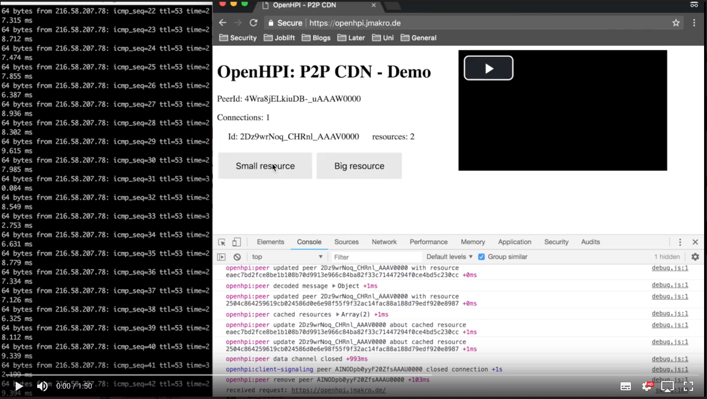

# PeerToPeer CDN
This project provides a peer to peer CDN to deliver content directly between browsers in a collaborative manner. It uses WebRTC for the content delivery and service worker to intercept requests. This project aims to be a plugin solution. So the changes required to add the peer to peer CDN should kept as small as possible. Currently only the whitelist of shareable resources needs to be changed to adapt the CDN to a new project.

## Browser Support
The Project is currently tested and developed for Chrome 68 only.

## Project Structure

| Folder        |                                                                 |
| ------------- |-------------                                                    |
| bin           | Contains the Node.js server for the demo app                    |
| build         | Contains scripts to compile and minify the ES6 JavaScript code  |
| src           | Contains the ES6 source files for the P2P CDN                   |
| web_app       | Contains the example application                                |

## Setup

You need to install the depending npm package before running the demo app:
```console
npm install
```
The JavaScript code of this Project is written in ES6 to compile the JavaScript code please run:
```console
npm install
npm run babel
npm run minify
```

To run the demo app please run:
```console
node index.js
```

To enable debug information, please make sure to set the environment variable ``DEBUG=openhpi*``.

### Docker container

To run the signaling server within a docker container, please build your own image using the provided dockerfile:
```console
docker build -f docker/Dockerfile . -t open_hpi_cdn
```
Execute the following command to run the container:
```console
docker run -it open_hpi_cdn
```
Debug information will be printed in that version. If you want to turn them off,
just remove the environment variable in the dockerfile. 

**Important:**
The server is running a HTTP server. But service worker require HTTPS to install. Therefore,
we recommend using an [letsencrypt-nginx-container](https://hub.docker.com/r/jrcs/letsencrypt-nginx-proxy-companion) and connect it to your container.

## Architecture
To give a broad idea about the architecture:

<p align="center">
  
</p>

The service worker intercepts the network request, checks its cache and peers and if 
someone is able to answer the request it will send a request to that peer.
By design, service worker are not able to interact via WebRTC directly. Therefore, 
the service worker communicates with the frontend via the ``onmessage`` event. Resources themselves are 
identified over the ```SHA-256-hash``` of the request url. You can find the service 
worker code in the [sw.js file](web_app/sw.js). The code that is handling the communication
between the service worker and the frontend can be found [here](src/client/js/middleware.js).

If you are new to service worker, we 
recommend reading the [google documentation](https://developers.google.com/web/fundamentals/primers/service-workers/#register_a_service_worker)
concerning this topic.   

### Message Protocol
The following sequential diagram shows how peers establish a connection:


Basically, every peer knows everyone within the network and their resources. 
An example request is visualized with the red lines. Meanwhile the connection establishment
the protocols SDP and ICE are used. These are natively used by the WebRTC standard.
To get familiar with these principles and usage, we found the [documentation by Mozilla](https://developer.mozilla.org/en-US/docs/Web/API/WebRTC_API/Protocols)
convenient.

### Signaling Server
The signaling server itself uses *socket.io* and can be found [here](src/server/signaling.js).
The client ID is created there and is essential for the lifecycle of a peer in the whole network.
It is not clear if the client IDs given by *socket.io* always have the same length. 
Therefore, client IDs will be padded to a maximal length of 24. 
This is necessary because the client IDs need to be sent via the binary datachannel and consequently, 
this requires a fixed length. 

##### What is happening to the datachannel message limit?

Currently, it is only possible to send messages not larger than 16kiB via the ``RTCDataChannel``. In order to send 
larger messages chunking and reassembling is necessary.
These procedures take place in the ``_abToMessage()`` and ``_sendToPeer()`` methods in the 
[peer.js](src/client/js/peer.js) file.  

## Demo
To see this project in action, please watch this:

<div align="center">
  <a href="https://drive.google.com/open?id=1MoI6pnDDNAFQpy4c0LvSPyTjphW0AUpR"></a>
</div>

In the left screen the Internet connection is checked via a ping to google.
In the right screen a *png* (~12KB), a *gif* (~12MB), and a video (~40MB) is requested.
At *0:45* the other peer is shown and he requests some resources.
At *1:10* the Internet connection is shot down but he is still able to 
watch the video and gets the *HLS segments* from the peer.

## Open issues
- Benchmark in a fixed environment is still needed to evaluate the performance.
- Alive messages for peers needs to be implemented to avoid issues when a peer dies.
- The service worker cache size is dynamically determined. Therefore, the cache size limits need to be 
evaluated more closely and when the entries are deleted (usage of the HTTP caching headers?). 
- At the moment, only Chrome is supported. A support for other browsers would be great.
- Security: The resource integrity needs to be ensured, f.i. via the HTML5 integrity tag. 
A connection limit also needs to be set for the signaling server. 

## Future work
- The new standard [SCTP ndata](https://tools.ietf.org/html/draft-ietf-tsvwg-sctp-ndata-13) would increase
the message size via the datachannel. This would imply that message chunking would not be
necessary any more. [Firefox](https://bugzilla.mozilla.org/show_bug.cgi?id=1381145) already tries to implement that feature, 
and so does [Chrome](https://bugs.chromium.org/p/webrtc/issues/detail?id=5696) both in a buggy way.
- Maybe there will be a time where service worker support WebRTC natively
but we do not really believe in that. Anyway, there is a discussion going on that is
addressing that [issue](https://github.com/w3c/webrtc-pc/issues/230). 

## Collaborators
- Johannes Maximilian Kroschewski
- Tim Friedrich
- Nils Straßenburg