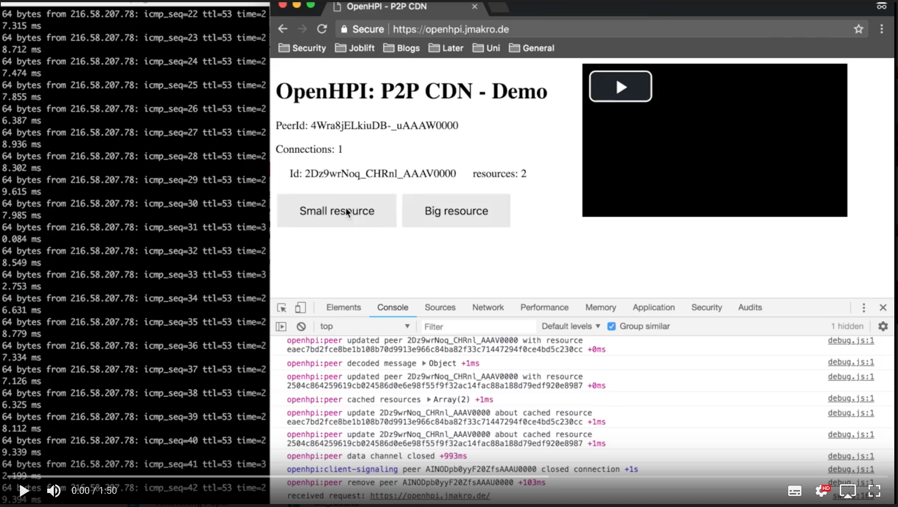
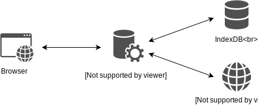

# Schulen, Digitalisierung, langsames Internet, langsames Arbeiten?

Wer kennt es nicht? Der Unterricht ist gut vorbereitet und Aufgabe der Schüler ist es unter Zuhilfenahme des Internets selbständig Unterrichtsinhalte zu recherchieren. Hierzu sollen ausgewählte Videos und andere interaktive Webseiten studiert werden. Einziges Problem: Das Internet ist viel zu langsam, die Schüler können die Videos nur Stück für Stück ansehen, auf den interaktiven Seiten werden die Bilder nur nach und nach geladen. Die Schüler sind genervt, die Lernbereitschaft sinkt und somit auch das Potential der eigentlich gut durchdachten Unterrichtsstunde. 

Auch wir vom Hasso Plattner Institut waren mal in der Schule und kennen genau dieses Problem; Zeit also sich eine Lösung zu überlegen.

## Verbesserungsbedarf!
Die Ursache für das oben beschriebene Szenario ist so gut wie immer auf eine zu geringe zur Verfügung stehenden Datenrate der Internetanbindung zurückzuführen. Dieser Flaschenhals lässt sich aufgrund des mangelnden Breitbandausbaus oder mangelnder finanzieller Mittel der Schulen oft nicht lösen. 

Die grundlegende Idee besteht deshalb darin, die Internetanbindung zu entlasten. Da oft alle Schüler nahezu die gleichen Ressourcen aus dem Internet anfragen, könnte dies dadurch realisiert werden, dass die Inhalte im lokalen Netzwerk verteilt werden. Unter der Annahme das in einer Schulklasse etwa 30 Schüler sind, könnte die Internetanbindung um bis zu Faktor 30 entlastet werden. Beachtet man zusätzlich, dass nicht nur eine Klasse gleichzeitig die Internetanbindung der Schule nutzt, ergibt sich ein noch größeres Optimierungspotential.

Eine grafische Gegenüberstellung der aktuellen bzw. der Situation, wie sie durch lokale Datenübertragung erreicht werden könnte, zeigen die folgenden beiden Abbildungen.

Alle Ressourcen werden aus dem Internet geladen | Ressourcen werden im lokalen Netzwerk verteilt  
:-------------------------:|:-------------------------:
  |  

Insgesamt geht es darum die Nutzbarkeit von Internetseiten mit datenintensiven Inhalten deutlich zu steigern. Wichtig hierfür ist, dass die lokale Verbreitung der Inhalte schneller abläuft, als das Laden dieser aus dem Internet. 

Um den Wartungsaufwand seitens der Schulen so gering wie möglich zu halten, ist es ebenfalls wünschenswert, dass keine zusätzliche Software installiert werden muss. Im Endeffekt soll keiner der Nutzer, weder Schüler noch Lehrer,  mitbekommen, dass etwas anders abläuft. Außer natürlich, dass die Inhalte schneller geladen werden und die entsprechende Internetseite so deutlich benutzbarer ist.

## Beispielszenario

Der Unterricht beginnt und es wird den Schülern mitgeteilt, dass sie eine bestimmte Internetseite aufrufen und sich die darauf befindlichen multimedialen Inhalte ansehen sollen.

Martin ist einer der ersten in der Klasse der ein Video zum gegebenen Thema findet und anguckt. In der Reihe hinter ihm wird Sina darauf aufmerksam und möchte sich dieses ebenfalls ansehen. Normalerweise würden Martin wie auch Sina das gesamte Video aus dem Internet anfragen und herunterladen. Doch warum fragt Sina's Computer nicht einfach bei Martin nach dem Video? Dieser hat dies und viele andere Dateien von der Internetseite ja bereits geladen. Genau dort liegt unserer Ansatz: Die Computer innerhalb einer Klasse sollen einen Verband bilden und Ressourcen jeglicher Art für die Mitschüler zur Verfügung stellen und diese im lokalen Netzwerk verteilen.

## Ein Prototyp

Das folgende Video zeigt mit einem Protoypen beispielhaft das oben beschriebene Szenario:

  

Im linken (schwarzen) Fenster wird kontinuierlich überprüft, ob eine Internetverbindung besteht. Im rechten Fester ist eine Testseite geöffnet. Insgesamt bietet diese eine Bild als eine vergleichsweise kleine Ressource, ein gif als eine vergleichsweise große und ein Video als eine sehr große Ressource an. 

Im ersten Teil sieht man, wie ein Nutzer alle drei Ressourcen anfragt und darstellt. Zum Zeitpunkt *00:45* wird auf den Bildschirm eines zweiten Nutzers umgeschaltet. Auch hier wird links kontinuierlich die Internetanbindung geprüft. Der Nutzer fragt auch hier alle drei Ressourcen an. Diese werden allerdings nicht über das Internet geladen, sondern vom ersten Nutzer. Dass die Ressourcen wirklich über das lokale Netz geladen werden, sieht man ab *01:10*. Wie links zu sehen ist, besteht ab diesem Zeitpunkt keine Verbindung mehr zum Internet. Dennoch kann das Video abgespielt werden und die benötigten Video Daten werden von dem Computer aus dem lokalen Netzwerk bezogen.

Durch unseren Prototypen zeigt sich, dass unsere grundlegende Idee umsetzbar ist und, dass unter Verwendung von Web-Technologien Daten direkt ausgetauscht werden können. Der große Vorteil ist, dass keine zusätzliche Softwarelösung benötigt wird, jedes Endgerät als Zwischenspeicher fungiert und somit die lokale Internetverbindung entlastet wird. Lässt man die verbleibenden technischen Herausforderungen außen vor, wäre dies deine attraktive Lösung die auch außerhalb des Kontextes einer Schule interessant wäre.

## Für die technisch Interessierten: Ein paar Details

Es folgt eine kleine Auswahl an technischen Fragen und Herausforderungen, die uns während der Umsetzung immer wieder begleitet haben.

#### Wie wird die Zwischenspeicherung der Daten realisiert?
Für unsere Implementation wird für das Zwischenspeichern von Daten ein *Serviceworker* eingesetzt. *Serviceworker* können wie ein Proxy zwischen dem Webbrowser und dem Webserver agieren, welcher die Webseite bereitstellt.
Stellt ein Browser eine Anfrage, so wird diese vom *Serviceworker* abgefangen. Der *Serviceworker* schaut zunächst in seinem Cache, der sog. *IndexDB*, ob er die gestellte Anfrage beantworten kann. Ist dies nicht der Fall, so wird die Anfrage an den Webserver weitergeleitet. Wird die gleiche Anfrage nochmals gestellt, kann diese aus dem Cache beantwortet werden, da gestellte Anfragen eine gewisse Zeit lang zwischengespeichert werden.

  

#### Welche Technologie wird zum Austausch der Daten genutzt?

Die von uns eingesetzte Technologie zur Übertragung von Daten zwischen Browsern ist *WebRTC*. *WebRTC* ist ein offener Standard und ermöglicht es Browser paarweise zwecks Datenaustausch zu verbinden. Der große Vorteil dieser Technologie ist, dass sie direkt von modernen Browsern unterstützt wird, wodurch keine zusätzliche Software installiert werden muss. Konkret wird von uns ein sog. *DataChannel* genutzt.

#### Wie wird eine Verbindung zwischen den Browsern zweier Schüler aufgebaut?

Für den Datenaustausch müssen wechselseitig *DataChannel* zueinander aufgebaut werden. Die Ausgangslage ist, dass die Schüler wissen, dass es den anderen gibt, aber nicht wie der jeweils andere zu erreichen ist. Um diese Problematik zu lösen, existiert ein Vermittlungsserver (*Signaling server*). 

Als erstes werden Informationen, über die Verbindung die aufgebaut werden soll, an den *Signaling server* gesendet. Technisch wird ein *SDP-offer* gesendet, wobei SDP für *Session Description Protocol* steht. Dieses *SDP-offer* leitet der *Signaling server* an die Schüler in der Klasse/Schule weiter. Geantwortet wird mit einer *SDP-answere*, welche Informationen über die abgestimmte Verbindung enthält und über den *Signaling server* zurück geleitet wird. 

Damit eine direkte Verbindung aufgebaut werden kann, müssen über den *Signaling server* noch weitere Informationen wie ICE-Kandidaten ausgetauscht werden. ICE steht hierbei für Interactive Conectivity Establishment und ist fester Bestandteil von *WebRTC*. Es ist für den Aufbau der Browser-zu-Browser-Verbindung verantwortlich. ICE-Kandidaten enthalten hauptsächlich Informationen darüber wie ein bestimmter Nutzer erreichbar ist (also z.B. private oder öffentliche IP-Adresse). Ermittelt werden diese ICE-Kandidaten mithilfe eines STUN-Servers und dem dazugehörigen Session Traversal Utilities for NAT (STUN) Protokoll. Wie der Name des Protokolls schon verrät, wird es vor allem benötigt um auch Nutzer erreichen zu können die keine eigene öffentliche IP-Adresse besitzen, bei denen also Network address translation (NAT) eingesetzt wird. Dies ist aufgrund der mangelnden Anzahl an IPv4-Adressen bei fast jedem Internetnutzer der Fall. 

#### Was steckt hinter dem *Signaling server*?

In dem *Signaling server* selbst wird die Logik abgebildet, wie die Klassen und Schüler miteinander in Verbindung stehen. Implementiert wurde dieser mit *socket.io*, da die native Klassenorganisation und Websocket-Technologie sich nahezu perfekt für unser Szenario anbot.

#### Wie weiß ein Browser wer die von ihm angefragte Ressource vorliegen hat?

In unserer Implementation wird, sobald eine neuer Besucher der Webseite hinzukommt, sofort ein *DataChannel*, mittels *WebRTC*, *STUN*, *ICE* und *Signaling server* zu allen anderen aktiven Besuchern aufgebaut. 
Über diesen werden zu zwei Zeitpunkten Informationen darüber ausgetauscht, welche Ressourcen bei dem jeweiligen Nutzer vorliegen: Direkt nach Aufbau des *DataChannels* und immer dann, wenn ein Nutzer eine neue Ressource (aus dem Internet oder lokal) geladen und in seinem Cache gespeichert hat:

Client 1 (C1) ist der erste der die Webseite aufruft. Er registriert sich beim *Signaling server* und fragt im Anschluss *img.png* an (rot). Da noch niemand anders auf der Seite ist von dem er die Ressource bekommen könnte und er zudem die Ressource nicht in seinem Cache hat, wird *img.png* über das Internet vom Webserver geladen. 
Client 2 (C2) ruft nun ebenfalls die Webseite auf und registriert sich beim *Signaling server*. Dieser benachrichtigt C1, dass ein neuer Teilnehmer registriert wurde, woraufhin C1 einen Verbindungsaufbau zu C2 einleitet. Steht die direkte Verbindung zwischen C1 und C2 (grün), teilt C1 C2 den Inhalt seines aktuellen Caches mit. Fragt C2 *img.png* an (rot), weiß er so, dass er diese von C1 anfragen kann. Hat er *img.png* erhalten, teilt er allen anderen Teilnehmern (in diesem Fall nur C1) mit, dass auch er jetzt *img.png* als Ressource in seinem Cache hat.

#### Noch offene technische Herausforderungen

Alle technischen Fragestellungen, die sich bezüglich der grundsätzlichen Funktionalität unserer Softwarelösung stellen wurden oben erläutert. Bevor ein Einsatz in einem Realen Umfeld vollzogen wird, sollten aber noch weitere technische Details beachtet werden. Die wichtigsten noch zu lösenden technischen Herausforderungen und mögliche Lösungsansätze hierfür sind im Folgenden aufgeführt.

- **Serialisierung der Daten:** 

	Wie oben erwähnt wird für den Austausch von Daten der von *WebRTC* angebotene *DataChannel* genutzt, welcher das *Stream Control Transmission Protocol* kurz SCTP verwendet. Problem hierbei ist, dass dieses Protokoll ursprünglich für die Übertragung von Kontrollinformationen designt wurde und deshalb für die Kompatibilität verschiedener Browser eine Paketgröße von 16kiB nicht überschritten werden sollte. In unserem Kontext ist es aber notwendig auch größere Dateien zu übertragen, weshalb aktuell viele kleine Datenpakete übertragen werden müssen, wodurch ein großer Overhead entsteht.

- **Integrität der Daten:**

	Es muss verhindert werden, dass ein bösartiger Nutzer manipulierte Ressourcen im lokalen Netzwerk verbreitet. Hierzu kann die Integritätsüberprüfung von HTML5 verwendet werden, bei der die Integrität der Daten mittels einer Prüfsumme sichergestellt wird.

- **Verteilung der Daten in größeren Gruppen:**

	Für den Austausch von Daten bilden aktuell alle Teilnehmer ein vollständig vermaschtes Netz. Bei einer Klassengröße von 30 hat also jeder Browser 29 offene *DataChannels*. Denkt man beispielsweise an eine Vollversammlung mit etwa 1000 Schülern, kann die große Anzahl der offenen *DataChannels* zu Problemen führen. In solche Szenarien sollt eine andere Topologie eingesetzt werden um die Anzahl der offenen *DataChannels* zu reduzieren. Am sinnvollsten wäre hier eine baumartige oder irregulär vermaschte Topologie.

- **Evaluierung der Performance:**

	Ziel unserer Softwarelösung ist es, die Benutzbarkeit von Internetseiten in Anwesenheit einer schlechten Internetanbindung zu verbessern. Interessant wäre es, den Performancezuwachs zu evaluieren, der durch den Einsatz unserer Lösung hervorgerufen wird. So könnte auch evaluiert werden, bis zu welcher zur Verfügung stehenden Datenrate der Einsatz unserer Lösung sinnvoll ist.

- **Verwaltung des Caches:**

	Wie bereits beschrieben, setzen wir für die Zwischenspeicherung der Daten einen *Serviceworker* ein, welcher wiederum die *IndexDB* verwaltet. Für die Zukunft sollte eine Lösung dafür gefunden werden ein sinnvolles Zeitfenster festzulegen in dem die Zwischengespeicherten Daten gültig sind, damit keine veralteten Daten ausgetauscht werden. Ein weiterer Punkt ist die Größe des Caches. Hier sollte evaluiert werden, wie die Maximalgröße des Caches und dessen Performance dabei ist. In Anlehnung hieran sollte eine Obergrenze für die menge der zwischengespeicherten Daten festgelegt werden.

Durch die Diskussion obiger technischer Fragestellungen, sowie der offenen Herausforderungen zeigt sich, dass unsere Implementation zwar ein fortgeschrittener *Proof of Concept* aber noch kein fertiges Softwareprodukt ist. Die größten offenen Baustellen sind unserer Ansicht nach die allgemeine Software- bzw. Netwerksicherheit sowie der große Overhead beim Segmentieren der Daten. Diese stellen zwar eine Herausforderungen dar, jedoch keine unlösbaren und so sind wir zuversichtlich, dass eine Weiterentwicklung unserer Software in naher Zukunft im Schulalltag Anwendung findet. 

